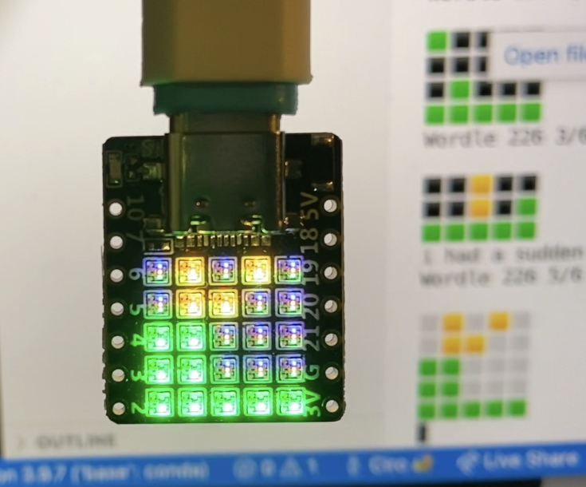

# wordle-device
Pull [Wordle](https://www.powerlanguage.co.uk/wordle/) solutions from the Twitter API and [displays them](https://twitter.com/ciro/status/1488259161066459142) on the 5x5 LED matrix of [this ESP32-C3 development board](https://www.cnx-software.com/2022/01/07/board-with-25-rgb-leds-is-offered-with-esp32-c3-or-esp32-pico-d4/).

